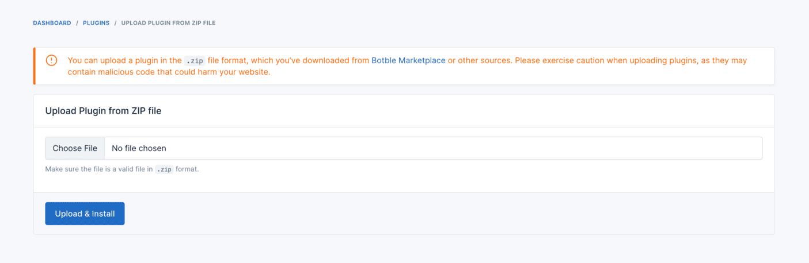

# Plugin Manager

The Plugin Manager plugin for Botble CMS allows you to easily install new plugins by uploading zip files directly through the admin panel. With this convenient tool, expanding the functionality of your website becomes a breeze.

Due to a security issue, you need to add `FOB_PLUGIN_MANAGER_ENABLED=true` to your `.env` file after activating this plugin in order to start using it.

## Requirements

-   Botble core 7.2.0 or higher.

## Installation

### Install via Admin Panel

-   Navigate to the Admin Panel.
-   Head over to the **Plugins** tab.
-   Click on the "Add new" button.
-   Locate the Plugin Manager plugin and click on the "Install" button.

### Install manually

1. Download the plugin from the [Botble Marketplace](https://marketplace.botble.com/products/friendsofbotble/fob-plugin-manager).
2. Extract the downloaded file and upload the extracted folder to the `platform/plugins` directory.
3. Go to **Admin** > **Plugins** and click on the **Activate** button.

## Goals

-   [x] **Easy Plugin Installation**: Simply upload a plugin zip file through the admin panel to install new plugins effortlessly.
-   [ ] **Install Botble packages with Dependencies**: The Plugin Manager plugin can install Botble packages with dependencies automatically.

## Contributing

Please see [CONTRIBUTING](CONTRIBUTING.md) for details.

## Security

If you discover any security related issues, please email friendsofbotble@gmail.com instead of using the issue tracker.

## Credits

-   [Friends Of Botble](https://github.com/FriendsOfBotble)
-   [All Contributors](../../contributors)

## License

The MIT License (MIT). Please see [License File](LICENSE) for more information.
